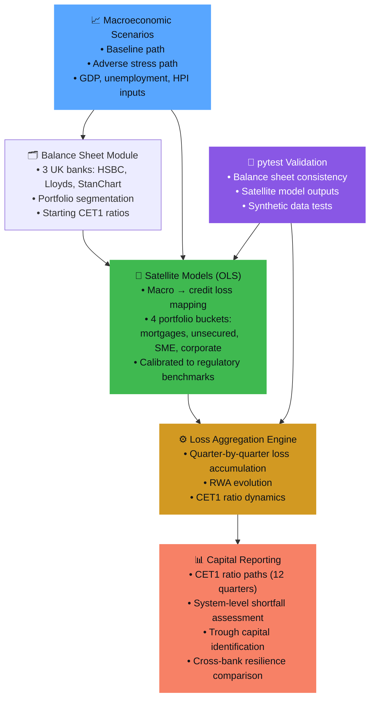

<div align="center">


<br/>

[](https://github.com/yashxsainix/macro-financial-stress-testing-Public)

<br/>

[](https://python.org)
[](https://statsmodels.org)
[](https://pytest.org)
[](https://pandas.pydata.org)

<br/>


</div>

---

## ❓ The Question This Project Answers

> *Given a specified macroeconomic stress path, how does bank capital evolve — and where do regulatory constraints bind?*

This is the question at the heart of every major financial stability exercise run by central banks and regulators worldwide. The Bank of England runs this every year. The Federal Reserve runs this under DFAST. This project implements that same supervisory logic transparently, using UK data, reproducible code, and validated outputs.

---

## 🏦 What Stress Testing Actually Does

When a severe recession hits — unemployment spikes, house prices fall, corporate defaults rise — banks absorb losses through their loan portfolios. Those losses consume capital. If capital falls below regulatory minimums, the bank cannot continue operating normally.

Stress testing answers: **how much capital does each bank have, how fast does it deplete under stress, and which banks breach regulatory thresholds?**

---

## 🏗️ Framework Architecture



---

## 📡 The Satellite Model Logic

The core of the framework is a set of **OLS satellite models** that translate macroeconomic variables into credit losses for each portfolio bucket.

```python
# Each satellite model follows regulatory convention:
# credit_loss_rate = f(GDP_growth, unemployment_change, HPI_change, ...)
# Calibrated to match observed UK loss rates under historical stress

# Example: Mortgage portfolio satellite
# PD_mortgages ~ β₀ + β₁·ΔHPI + β₂·ΔUnemployment + β₃·GDP_gap + ε
```

This approach separates **macroeconomic scenario design** from **loss transmission** — the same pattern used in DFAST, EBA stress tests, and Bank of England FST exercises.

---

## 🏛️ Banks and Portfolio Buckets

**Banks modeled** — selected to represent distinct business models:
| Bank | Business Model | Key Exposure |
|------|----------------|-------------|
| HSBC | Global diversified | International corporate |
| Lloyds Banking Group | Domestic retail | UK mortgages + consumer |
| Standard Chartered | Emerging markets | Export-oriented corporate |

**Portfolio buckets:**
- 🏠 Owner-occupied mortgages
- 💳 Consumer unsecured credit
- 🏭 SME lending
- 🏢 Large corporate lending

---

## 📊 Key Results

<details>
<summary><b>📉 Capital Ratio Paths — Adverse Scenario</b></summary>

Under the adverse macroeconomic stress, capital depletion differs materially across banks due to differences in starting capital positions and portfolio composition. Losses are **front-loaded** — the largest capital impact occurs within the first 4 quarters of the stress horizon.

The framework generates CET1 ratio paths for each bank across all 12 quarters, identifying when (and whether) each institution breaches the regulatory minimum threshold.

</details>

<details>
<summary><b>⚠️ System-Level Shortfall Assessment</b></summary>

System-wide capital shortfall is calculated as the aggregate deficit across all banks that breach the regulatory floor under the adverse scenario. This is the headline metric used in official stress test publications.

Results are reported as conditional outcomes — not forecasts — making clear that the analysis answers *"what would happen under this scenario"*, not *"what will happen."*

</details>

<details>
<summary><b>📈 Cross-Bank Resilience Comparison</b></summary>

Banks with higher starting CET1 ratios and lower exposure to macro-sensitive portfolios (e.g., SME lending during a recession) show materially greater resilience. The framework allows direct comparison of trough capital positions across institutions under a **common stress** — which is the core purpose of supervisory stress testing.

</details>

---

## 🗂️ Repository Structure

```
macro-financial-stress-testing/
│
├── src/stress_test/
│   ├── balance_sheet.py    ← Bank balance sheets + portfolio segmentation
│   ├── scenarios.py        ← Baseline and adverse macro scenario definitions
│   ├── satellite.py        ← OLS macro → loss mapping models
│   ├── engine.py           ← Loss aggregation + CET1 capital dynamics
│   ├── reporting.py        ← Tables, figures, and summary outputs
│   ├── data.py             ← UK macro data loader
│   └── config.py           ← Constants and naming conventions
│
├── scripts/
│   └── run_stress_test.py  ← Pipeline orchestration entry point
│
├── tests/
│   ├── test_balance_sheet.py   ← Balance sheet consistency tests
│   ├── test_satellite.py       ← Satellite model output validation
│   └── test_synthetic_data.py  ← Data generation tests
│
└── outputs/
    ├── figures/            ← CET1 ratio paths, loss paths, trough charts
    └── tables/             ← System results, trough summary, loss by bucket
```

---

## 🚀 How to Run

```bash
git clone https://github.com/yashxsainix/macro-financial-stress-testing-Public
pip install -r requirements.txt

# Run the full stress test pipeline
python scripts/run_stress_test.py

# Run validation suite
pytest tests/ -v

# Outputs appear in outputs/figures/ and outputs/tables/
```

---

## 📚 Why This Matters Beyond Finance

Stress testing is applied thinking. You define a scenario, trace its effects through a system, and answer "where does it break?" That discipline — mapping a shock through a pipeline to a measurable outcome — is exactly how good analytical frameworks should be designed regardless of domain.

This project demonstrates that thinking with quantitative rigor, reproducible code, and audit-ready documentation.

---

## 👤 Author

**Yashpal Saini** · [LinkedIn](https://linkedin.com/in/yash-saini-analyst) · [Portfolio](https://yashxsainix.github.io)


