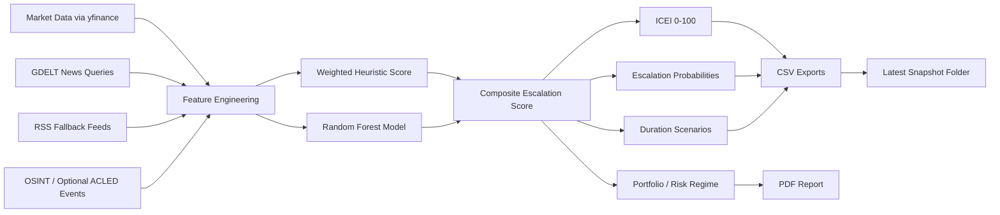

# Iran Conflict Escalation Dashboard

<p align="center">
  <b>Geopolitical risk intelligence pipeline for monitoring Iran-Israel escalation through markets, news, and OSINT signals.</b>
</p>

<p align="center">
  
  
  
  
  
  
</p>

<p align="center">
  <a href="./conflict_escalation_dashboard_ml_pdf_v5.ipynb"><b>Open Notebook</b></a> •
  <a href="./conflict_dashboard_report_example.pdf"><b>View Sample PDF Report</b></a> •
  <a href="./latest/escalation_index_history.csv"><b>Latest ICEI History</b></a>
</p>

---

## Author
**Yashpal Saini**

---

## What this project does
This project builds a **quantitative conflict-monitoring dashboard** that translates real-world geopolitical tension into a structured daily risk view. It combines:

- **Cross-asset market data** from energy, volatility, FX, shipping, crypto, and defense proxies
- **News intelligence** using GDELT queries with RSS fallback when rate limits occur
- **OSINT conflict events** pulled from a GitHub-hosted attack-wave database
- **Optional ACLED event enrichment** for additional ground-truth validation
- **A hybrid scoring + machine learning framework** that estimates escalation pressure, duration, and regime shifts

The result is a repeatable system that outputs:
- an **Iran Conflict Escalation Index (ICEI)** on a 0–100 scale,
- **probabilities for escalation / stabilization / de-escalation**,
- **duration scenario estimates**,
- **chokepoint stress signals** such as Strait of Hormuz risk,
- and a **PDF-ready analyst report** for decision support.

---

## Why it matters
Traditional news monitoring tells you *what happened*. This dashboard is designed to help answer a harder question:

> **How severe is the situation becoming, how fast is it changing, and what does the broader signal environment imply right now?**

Instead of relying on one source, the project triangulates market behavior, media tone, and verified conflict events into a single operating picture.

---

## Core capabilities

### 1) Multi-source signal fusion
The dashboard merges multiple information layers into one escalation framework:

| Signal Layer | What it captures |
|---|---|
| **Markets** | Oil shocks, crude volatility, Israeli shekel moves, defense/energy equity reactions, shipping proxies, crypto risk sentiment |
| **News / GDELT** | Conflict intensity, ceasefire language, Hormuz disruption narratives, proxy activity, force deployment references |
| **OSINT events** | Verified attack-wave activity and event-linked escalation markers |
| **Optional ACLED** | Structured conflict-event counts for added validation |

### 2) Hybrid modeling
The pipeline uses both:
- a **heuristic weighted escalation score**, and
- a **Random Forest classifier** trained on event-linked conflict patterns.

This creates a more resilient system than relying on a single rule or a single model.

### 3) ICEI: Iran Conflict Escalation Index
The project maps raw model output into a **0–100 index** so the result is interpretable, easier to visualize, and suitable for daily tracking.

### 4) Duration outlook
Beyond current pressure, the dashboard estimates likely conflict persistence through three scenario buckets:
- **Short war:** 2–4 weeks
- **Extended conflict:** 1–3 months
- **Long proxy / hybrid conflict:** 6+ months

### 5) Analyst-ready reporting
The system exports structured files and produces a **multi-page PDF report** with charts, probabilities, regime summaries, and signal availability diagnostics.

---

## How the pipeline works



---

## Project highlights

### Cross-asset market coverage
The notebook tracks instruments tied to conflict repricing, including:
- **Brent and WTI crude**
- **Natural gas**
- **VIX and OVX**
- **USD proxy**
- **Energy and defense proxies**
- **Gold, Treasuries, high yield credit, broad equities**
- **Bitcoin and Ethereum**
- **Tanker and shipping names linked to Hormuz / Red Sea stress**
- **Israeli shekel for direct regional pressure sensing**

### Conflict-aware news structure
The news engine is designed around escalation-specific themes such as:
- direct Iran-Israel / US strike activity,
- ceasefire and negotiation language,
- Strait of Hormuz disruption,
- proxy warfare,
- troop deployment and US force posture.

### Operational automation
The repository includes a **GitHub Actions workflow** that can run the dashboard on a schedule, persist outputs, and generate a text summary for distribution.

---

## Repository structure

```text
Iran_Conflict_Dashboard-main/
├── .github/
│   └── workflows/
│       └── daily_run.yml
├── latest/
│   ├── data_availability_summary.csv
│   └── escalation_index_history.csv
├── scripts/
│   └── generate_summary.py
├── conflict_escalation_dashboard_ml_pdf_v5.ipynb
├── conflict_dashboard_report_example.pdf
├── requirements.txt
├── CONTRIBUTING.md
├── LICENSE
└── README.md
```

---

## Outputs
After execution, the project produces a practical set of artifacts for analysis and communication.

| Output | Description |
|---|---|
| **Escalation history CSV** | Time-series record of ICEI, probabilities, scores, and regime outputs |
| **Availability summary CSV** | Health check for market, news, and event layers |
| **PDF report** | Executive-style report summarizing the latest state of the dashboard |
| **Notebook outputs** | Charts, tables, signal diagnostics, and scenario views |
| **Generated text summary** | Plain-English briefing created by the summary script |

---

## Example analytical questions this project can support
- Is the current signal set pointing toward **active escalation**, **stabilization**, or **de-escalation**?
- Are **market-based stress signals** moving ahead of the news cycle?
- Is **Hormuz disruption risk** becoming material?
- Are conflict dynamics likely to remain **short-lived** or evolve into a **longer proxy cycle**?
- Are signal families live and healthy enough to trust the latest regime output?

---

## Tech stack

| Area | Tools |
|---|---|
| **Language** | Python |
| **Notebook environment** | Jupyter / Google Colab |
| **Data access** | yfinance, requests, RSS feeds, optional BigQuery / ACLED |
| **Analytics** | pandas, numpy, scipy |
| **Machine learning** | scikit-learn |
| **Visualization** | matplotlib, plotly |
| **Reporting** | ReportLab |
| **Automation** | GitHub Actions, papermill |

---

## Installation

### 1) Clone the repository
```bash
git clone <your-repo-url>
cd Iran_Conflict_Dashboard-main
```

### 2) Install dependencies
```bash
pip install -r requirements.txt
```

### 3) Launch the notebook
```bash
jupyter notebook
```
Then open:
```text
conflict_escalation_dashboard_ml_pdf_v5.ipynb
```

---

## Quick start in Colab
This project is structured to run cleanly in **Google Colab** from top to bottom.

Typical flow:
1. Install packages
2. Configure model parameters
3. Pull market + news + event data
4. Generate features and escalation signals
5. Run the hybrid model
6. Export charts, CSVs, and PDF report

This makes the project easy to demo, test, and share without requiring a full local environment.

---

## Modeling logic at a glance

### Escalation state probabilities
The dashboard outputs a probability split across three mutually exclusive states:
- **Escalation**
- **Stabilization**
- **De-escalation**

### ICEI scale
The index is designed to turn model output into an interpretable range:

| ICEI Range | Interpretation |
|---|---|
| **0–35** | Low pressure / stabilization bias |
| **35–50** | Contained but active tension |
| **50–65** | Elevated risk |
| **65–80** | Escalation likely / active intensification |
| **80+** | Severe or regionally dangerous environment |

### Duration layer
The project also models how long elevated tension may persist, which is useful because not all escalations resolve on the same timeline.

---

## What makes this project strong for a portfolio
This is not just a dashboard. It demonstrates several high-value analytics skills in one project:

- **Data engineering:** collecting and structuring multi-source external data
- **Feature design:** turning messy geopolitical and market signals into usable indicators
- **Predictive modeling:** blending rule-based and ML-driven logic
- **Risk intelligence:** translating raw signals into interpretable regime outputs
- **Reporting automation:** producing reusable PDFs and summary artifacts
- **Operational thinking:** enabling scheduled execution and recurring monitoring

It is especially strong for roles in:
- data analytics,
- risk intelligence,
- market research,
- strategy analytics,
- economic / geopolitical reporting,
- and decision-support automation.

---

## Limitations
No geopolitical model is perfect, and this project is transparent about that.

- News data can lag or be noisy.
- Market moves may reflect multiple narratives at once.
- OSINT coverage depends on what is publicly observable.
- Optional datasets such as ACLED may not always be enabled.
- The system is designed for **monitoring and structured analysis**, not certainty.

That said, the value of the project is in **systematic signal aggregation**, **repeatable tracking**, and **clear communication of risk conditions**.

---

## Future improvements
Potential upgrades for extending the project further:
- interactive web deployment with Streamlit or Dash,
- model explainability views for signal contribution tracing,
- richer event-labeling logic,
- more advanced NLP sentiment and entity extraction,
- scenario comparison dashboards,
- alerting integrations for Slack / email / webhook delivery.

---

## Sample value proposition
> A portfolio-grade geopolitical analytics system that monitors conflict escalation through cross-asset market behavior, structured news signals, and OSINT event data, then converts those signals into a daily escalation index, regime probabilities, and analyst-ready reporting.

---

